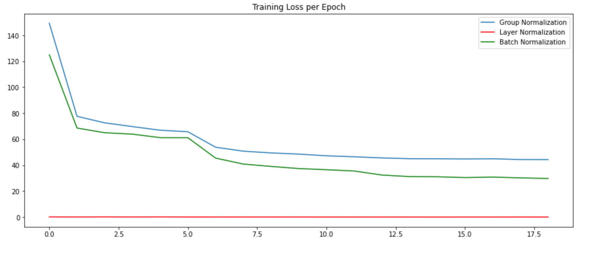
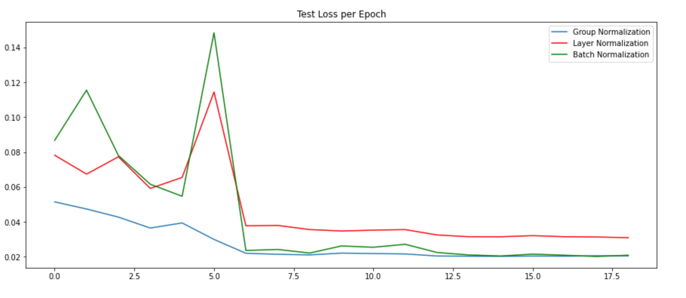
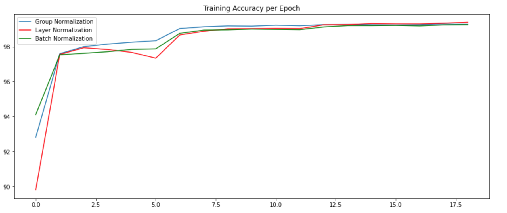
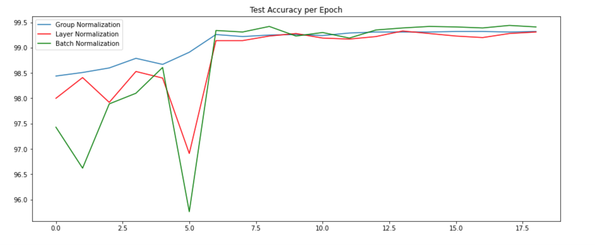
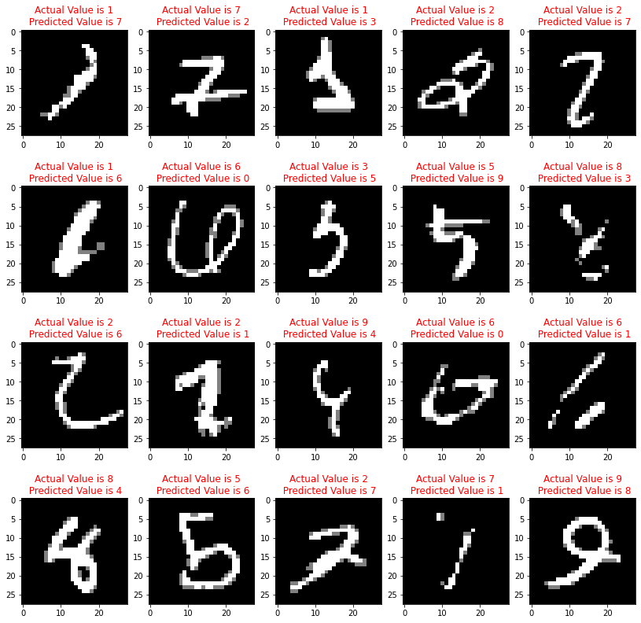
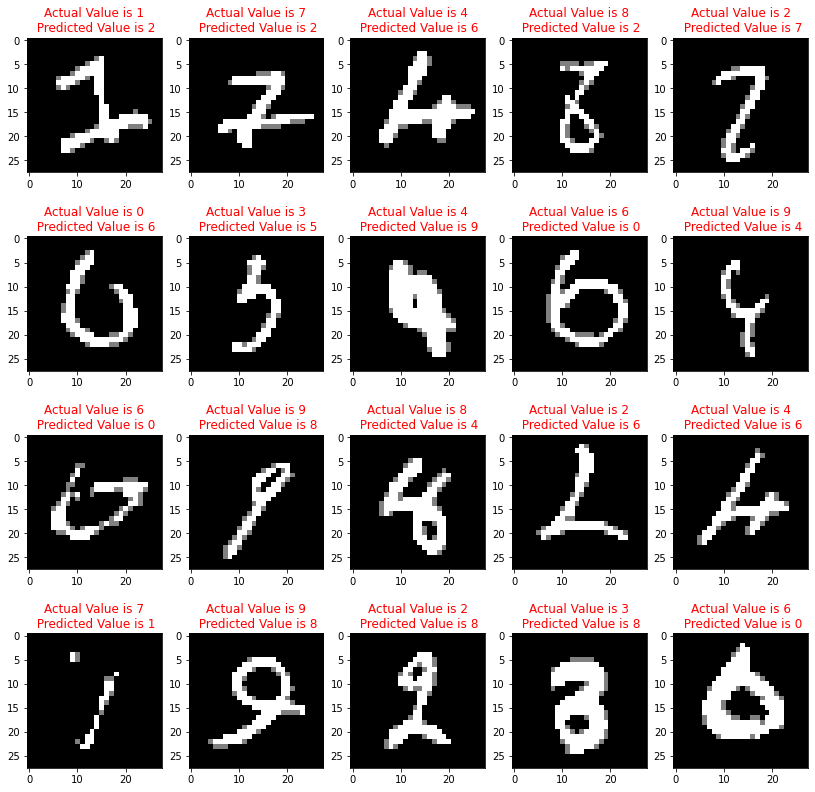
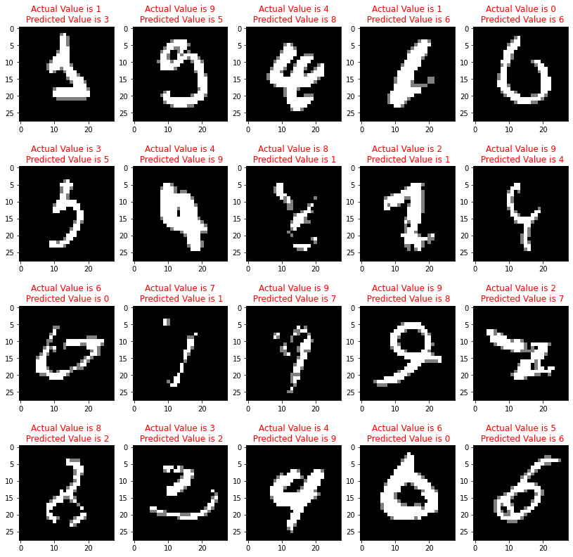

## Team ##

* Praveen Pethurajan
* Ashwin Aralamallige Gopalakrishna
* L.Mahesh
* Pratima Verma

### Session 6 Assignment ###

# Normalization and Regularization

- There are three types of Normalization
    - Batch Normalization
    - Layer Normalization
    - Group Normalization

Objective is to implement 3 normalization techniques (Batch Normalization, Layer Normalization, Group Normalization) and regularization techniques(L1 Loss and L2 Loss) on MNIST dataset.

# Implementation

The module model consists of different classification models which implements 3 different normalization techniques with regularization. Each classification model is executed and corresponding graphs(Training Loss per Epoch, Test Loss per Epoch, Test Accuracy per Epoch, Training Accuracy per Epoch) are plotted along with the misclassified images from each network.

#  Finidings for different Normalization Techniques
- Data normalization is an important step which ensures that each input parameter (pixel, in this case) has a similar data distribution.
- This makes convergence faster while training the network.
- We normalize the data so that calculations are smaller and also to make features common.
- By normalization we try to remove the color and focus only on feature.
- Batchnorm is better because it works feature wise.
- Layer norm and groupnorm work image wise and they actually suppress important feature maps based on useless feature maps.

# Grpahs for Models with different Normalization and Regularization
## 1. Training Loss

## 2. Test Loss

## 3. Training Accuracy

## 4. Test Accuracy

# Misclassified Images for each model
## 1. Network with Group Normalization

## 2. Network with Layer Normalization

## 3. Network with Batch Normalization

