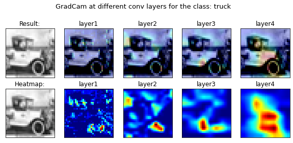

### Session 8 Assignment ###

# Problem Statement
- Train for 40 Epochs
- 20 misclassified images
- 20 GradCam output on the SAME misclassified images
- Apply these transforms while training:
  - RandomCrop(32, padding=4)
  - CutOut(16x16)
  - Rotate(±5°)
- Must use ReduceLROnPlateau
- Must use LayerNormalization ONLY

## Trained Model Summary

- Parameters - 176,426
- Epoch - 110
- Dropout - 0.1
- L2 - 0.001
- Best Training Accuracy - 85.45%
- Test Accuracy - 82.71%

Summary - 
```
----------------------------------------------------------------
        Layer (type)               Output Shape         Param #
================================================================
            Conv2d-1           [-1, 64, 32, 32]           1,728
         GroupNorm-2           [-1, 64, 32, 32]             128
            Conv2d-3           [-1, 64, 32, 32]          36,864
         GroupNorm-4           [-1, 64, 32, 32]             128
            Conv2d-5           [-1, 64, 32, 32]          36,864
         GroupNorm-6           [-1, 64, 32, 32]             128
        BasicBlock-7           [-1, 64, 32, 32]               0
            Conv2d-8           [-1, 64, 32, 32]          36,864
         GroupNorm-9           [-1, 64, 32, 32]             128
           Conv2d-10           [-1, 64, 32, 32]          36,864
        GroupNorm-11           [-1, 64, 32, 32]             128
       BasicBlock-12           [-1, 64, 32, 32]               0
           Conv2d-13          [-1, 128, 16, 16]          73,728
        GroupNorm-14          [-1, 128, 16, 16]             256
           Conv2d-15          [-1, 128, 16, 16]         147,456
        GroupNorm-16          [-1, 128, 16, 16]             256
           Conv2d-17          [-1, 128, 16, 16]           8,192
        GroupNorm-18          [-1, 128, 16, 16]             256
       BasicBlock-19          [-1, 128, 16, 16]               0
           Conv2d-20          [-1, 128, 16, 16]         147,456
        GroupNorm-21          [-1, 128, 16, 16]             256
           Conv2d-22          [-1, 128, 16, 16]         147,456
        GroupNorm-23          [-1, 128, 16, 16]             256
       BasicBlock-24          [-1, 128, 16, 16]               0
           Conv2d-25            [-1, 256, 8, 8]         294,912
        GroupNorm-26            [-1, 256, 8, 8]             512
           Conv2d-27            [-1, 256, 8, 8]         589,824
        GroupNorm-28            [-1, 256, 8, 8]             512
           Conv2d-29            [-1, 256, 8, 8]          32,768
        GroupNorm-30            [-1, 256, 8, 8]             512
       BasicBlock-31            [-1, 256, 8, 8]               0
           Conv2d-32            [-1, 256, 8, 8]         589,824
        GroupNorm-33            [-1, 256, 8, 8]             512
           Conv2d-34            [-1, 256, 8, 8]         589,824
        GroupNorm-35            [-1, 256, 8, 8]             512
       BasicBlock-36            [-1, 256, 8, 8]               0
           Conv2d-37            [-1, 512, 8, 8]       1,179,648
        GroupNorm-38            [-1, 512, 8, 8]           1,024
           Conv2d-39            [-1, 512, 8, 8]       2,359,296
        GroupNorm-40            [-1, 512, 8, 8]           1,024
           Conv2d-41            [-1, 512, 8, 8]         131,072
        GroupNorm-42            [-1, 512, 8, 8]           1,024
       BasicBlock-43            [-1, 512, 8, 8]               0
           Conv2d-44            [-1, 512, 8, 8]       2,359,296
        GroupNorm-45            [-1, 512, 8, 8]           1,024
           Conv2d-46            [-1, 512, 8, 8]       2,359,296
        GroupNorm-47            [-1, 512, 8, 8]           1,024
       BasicBlock-48            [-1, 512, 8, 8]               0
           Linear-49                   [-1, 10]           5,130
================================================================
Total params: 11,173,962
Trainable params: 11,173,962
Non-trainable params: 0
----------------------------------------------------------------
Input size (MB): 0.01
Forward/backward pass size (MB): 13.50
Params size (MB): 42.63
Estimated Total Size (MB): 56.14
----------------------------------------------------------------
```

## Logs:-

```
Epoch: 1
Train Loss: 2.758 | Train Acc: 15.316% (7658/50000)
Test Loss: 2.156 | Test Acc: 20.700% (2070/10000)

Epoch: 2
Train Loss: 2.009 | Train Acc: 24.516% (12258/50000)
Test Loss: 1.873 | Test Acc: 30.850% (3085/10000)

Epoch: 3
Train Loss: 1.829 | Train Acc: 31.166% (15583/50000)
Test Loss: 1.703 | Test Acc: 35.880% (3588/10000)

Epoch: 4
Train Loss: 1.703 | Train Acc: 36.272% (18136/50000)
Test Loss: 1.626 | Test Acc: 40.220% (4022/10000)

Epoch: 5
Train Loss: 1.616 | Train Acc: 40.038% (20019/50000)
Test Loss: 1.485 | Test Acc: 44.250% (4425/10000)

Epoch: 6
Train Loss: 1.511 | Train Acc: 44.064% (22032/50000)
Test Loss: 1.320 | Test Acc: 51.100% (5110/10000)

Epoch: 7
Train Loss: 1.417 | Train Acc: 48.194% (24097/50000)
Test Loss: 1.254 | Test Acc: 53.870% (5387/10000)

Epoch: 8
Train Loss: 1.327 | Train Acc: 51.942% (25971/50000)
Test Loss: 1.244 | Test Acc: 54.070% (5407/10000)

Epoch: 9
Train Loss: 1.246 | Train Acc: 54.984% (27492/50000)
Test Loss: 1.350 | Test Acc: 50.630% (5063/10000)

Epoch: 10
Train Loss: 1.156 | Train Acc: 58.468% (29234/50000)
Test Loss: 1.069 | Test Acc: 62.010% (6201/10000)

Epoch: 11
Train Loss: 1.123 | Train Acc: 59.722% (29861/50000)
Test Loss: 1.079 | Test Acc: 61.340% (6134/10000)

Epoch: 12
Train Loss: 1.072 | Train Acc: 61.654% (30827/50000)
Test Loss: 0.936 | Test Acc: 66.010% (6601/10000)

Epoch: 13
Train Loss: 1.019 | Train Acc: 63.888% (31944/50000)
Test Loss: 0.926 | Test Acc: 67.040% (6704/10000)

Epoch: 14
Train Loss: 0.965 | Train Acc: 65.864% (32932/50000)
Test Loss: 0.969 | Test Acc: 65.590% (6559/10000)

Epoch: 15
Train Loss: 0.928 | Train Acc: 67.510% (33755/50000)
Test Loss: 0.887 | Test Acc: 69.890% (6989/10000)

Epoch: 16
Train Loss: 0.875 | Train Acc: 69.216% (34608/50000)
Test Loss: 0.915 | Test Acc: 67.980% (6798/10000)

Epoch: 17
Train Loss: 0.819 | Train Acc: 71.402% (35701/50000)
Test Loss: 0.806 | Test Acc: 71.610% (7161/10000)

Epoch: 18
Train Loss: 0.785 | Train Acc: 72.882% (36441/50000)
Test Loss: 0.741 | Test Acc: 74.820% (7482/10000)

Epoch: 19
Train Loss: 0.770 | Train Acc: 73.416% (36708/50000)
Test Loss: 0.686 | Test Acc: 76.370% (7637/10000)

Epoch: 20
Train Loss: 0.728 | Train Acc: 74.730% (37365/50000)
Test Loss: 0.863 | Test Acc: 70.470% (7047/10000)

Epoch: 21
Train Loss: 0.718 | Train Acc: 75.078% (37539/50000)
Test Loss: 0.660 | Test Acc: 76.890% (7689/10000)

Epoch: 22
Train Loss: 0.683 | Train Acc: 76.590% (38295/50000)
Test Loss: 0.676 | Test Acc: 76.120% (7612/10000)

Epoch: 23
Train Loss: 0.675 | Train Acc: 76.912% (38456/50000)
Test Loss: 0.604 | Test Acc: 79.320% (7932/10000)

Epoch: 24
Train Loss: 0.659 | Train Acc: 77.350% (38675/50000)
Test Loss: 0.641 | Test Acc: 77.710% (7771/10000)

Epoch: 25
Train Loss: 0.646 | Train Acc: 77.944% (38972/50000)
Test Loss: 0.559 | Test Acc: 80.790% (8079/10000)

Epoch: 26
Train Loss: 0.628 | Train Acc: 78.554% (39277/50000)
Test Loss: 0.650 | Test Acc: 78.170% (7817/10000)

Epoch: 27
Train Loss: 0.631 | Train Acc: 78.340% (39170/50000)
Test Loss: 0.647 | Test Acc: 78.310% (7831/10000)

Epoch: 28
Train Loss: 0.616 | Train Acc: 78.982% (39491/50000)
Test Loss: 0.622 | Test Acc: 78.540% (7854/10000)

Epoch: 29
Train Loss: 0.604 | Train Acc: 79.340% (39670/50000)
Test Loss: 0.641 | Test Acc: 78.080% (7808/10000)

Epoch: 30
Train Loss: 0.388 | Train Acc: 86.708% (43354/50000)
Test Loss: 0.381 | Test Acc: 86.920% (8692/10000)

Epoch: 31
Train Loss: 0.347 | Train Acc: 87.864% (43932/50000)
Test Loss: 0.369 | Test Acc: 87.450% (8745/10000)

Epoch: 32
Train Loss: 0.325 | Train Acc: 88.784% (44392/50000)
Test Loss: 0.361 | Test Acc: 87.980% (8798/10000)

Epoch: 33
Train Loss: 0.309 | Train Acc: 89.288% (44644/50000)
Test Loss: 0.342 | Test Acc: 88.290% (8829/10000)

Epoch: 34
Train Loss: 0.297 | Train Acc: 89.834% (44917/50000)
Test Loss: 0.344 | Test Acc: 88.200% (8820/10000)

Epoch: 35
Train Loss: 0.289 | Train Acc: 89.912% (44956/50000)
Test Loss: 0.334 | Test Acc: 88.760% (8876/10000)

Epoch: 36
Train Loss: 0.277 | Train Acc: 90.484% (45242/50000)
Test Loss: 0.327 | Test Acc: 88.770% (8877/10000)

Epoch: 37
Train Loss: 0.273 | Train Acc: 90.514% (45257/50000)
Test Loss: 0.339 | Test Acc: 88.610% (8861/10000)

Epoch: 38
Train Loss: 0.262 | Train Acc: 90.842% (45421/50000)
Test Loss: 0.324 | Test Acc: 89.400% (8940/10000)

Epoch: 39
Train Loss: 0.255 | Train Acc: 91.170% (45585/50000)
Test Loss: 0.345 | Test Acc: 88.630% (8863/10000)

Epoch: 40
Train Loss: 0.249 | Train Acc: 91.486% (45743/50000)
Test Loss: 0.326 | Test Acc: 89.010% (8901/10000)
Best Acc is :  89.4
```


## Graphs And Analysis:-

  - Loss&accuracy graphs
  
    
    
  - Correct Predictions
  
    
    
  - Wrong Predictions
  
    
    
  - Gradcam Correct Predictions [First 10 samples]
    - Sample 1
 
    
    - Sample 2
    
    
    - Sample 3
    
    
    - Sample 4
    
    
    - Sample 5
    
    
    - Sample 6
    
    
    - Sample 7
    
    
    - Sample 8
    
    
    - Sample 9
    
    
    - Sample 10
    
    

  - Gradcam wrong Predictions [First 10 samples]
  
    - Sample 1
 
    
    - Sample 2
    
    
    - Sample 3
    
    
    - Sample 4
    
    
    - Sample 5
    
    
    - Sample 6
    
    
    - Sample 7
    
    
    - Sample 8
    
    
    - Sample 9
    
    
    - Sample 10
    
    
  

### Result

*   Parameters: 11,173,962
*   Best Train Accuracy: 89.4%
*   Best Test Accuracy: 91.486%


